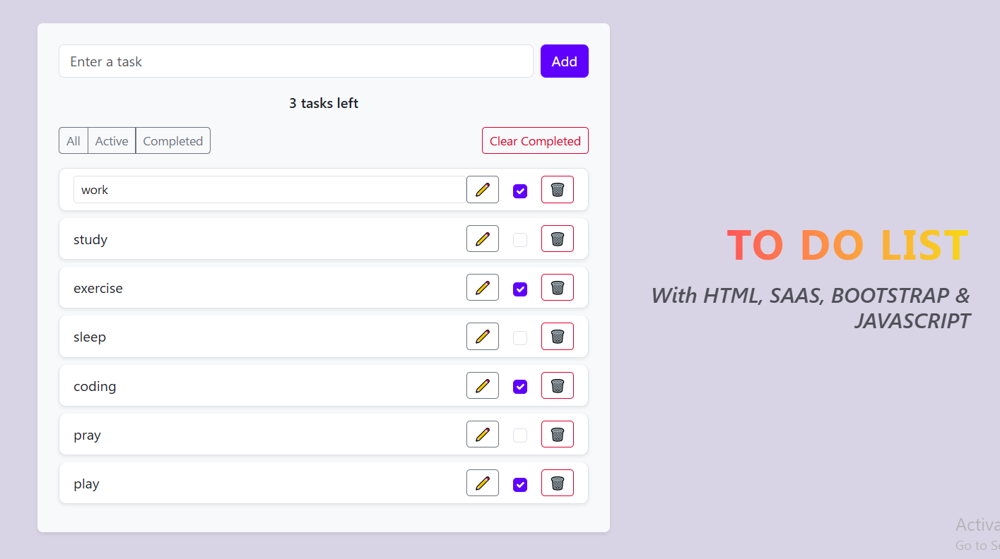
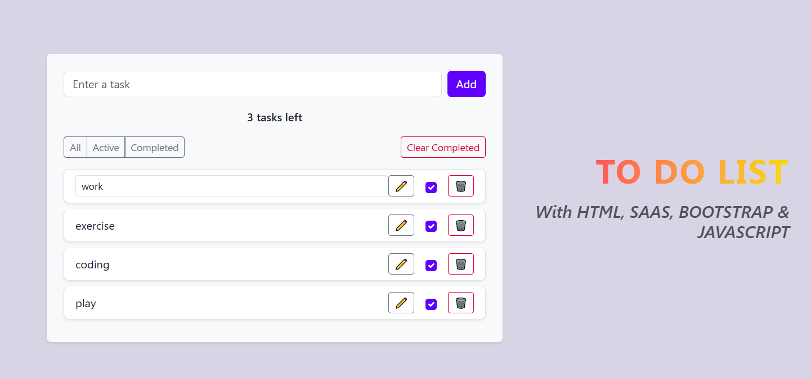
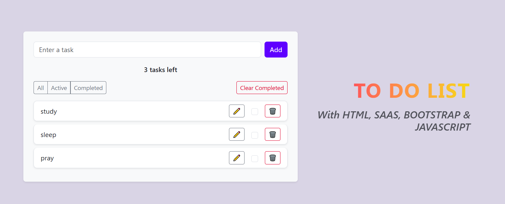
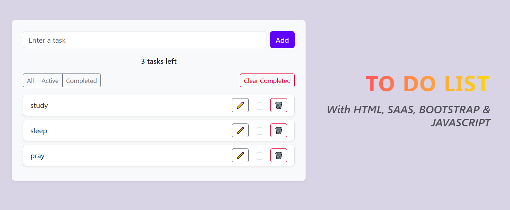

# To-Do App

A fully-featured, interactive To-Do application built with **HTML**, **CSS**, and **JavaScript**.  
This app allows users to manage their daily tasks efficiently with a clean and user-friendly interface.

---

## Features
- Add new tasks
- Edit existing tasks
- Delete tasks with a **custom CSS delete button**
- Mark tasks as completed
- Responsive and mobile-friendly design
- Clear all tasks option

---

## Technologies Used
- **HTML** – Structure and layout
- **CSS** – Styling, including custom buttons
- **JavaScript (ES6)** – Logic for task management
- **Bootstrap** for styling enhancements

---

## Live Demo
[Click here to see the live demo](https://warda-create.github.io/todoapp/)

---

## Installation
Follow these steps to run the app locally:

1. Clone the repository:
```bash
git clone https://github.com/Warda-create/todoapp.git


## Screenshots






