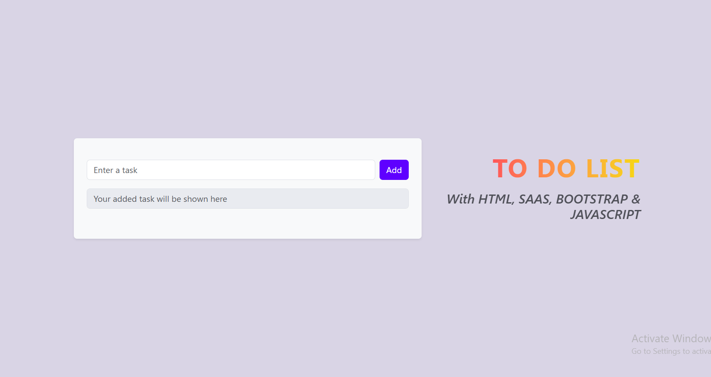
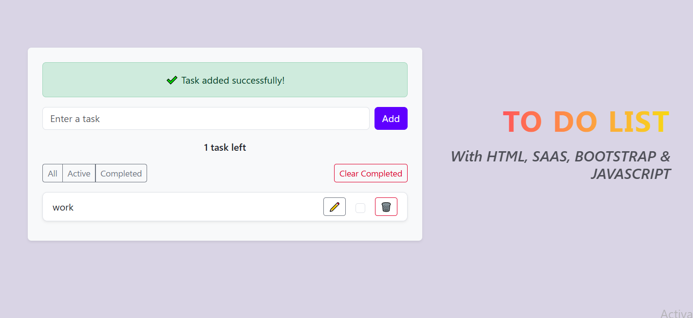
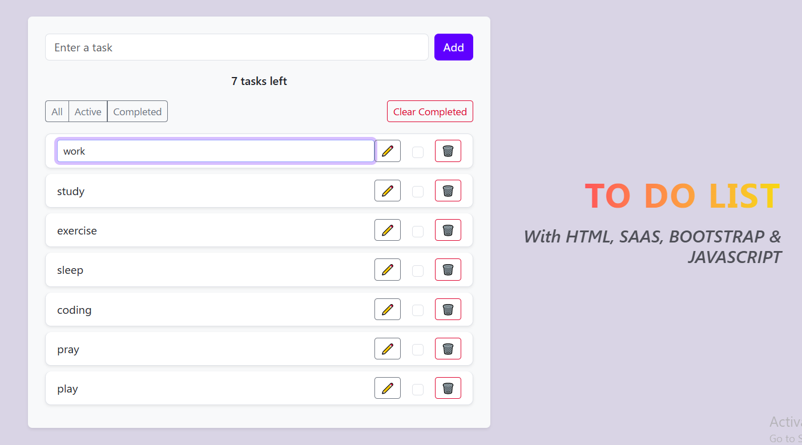
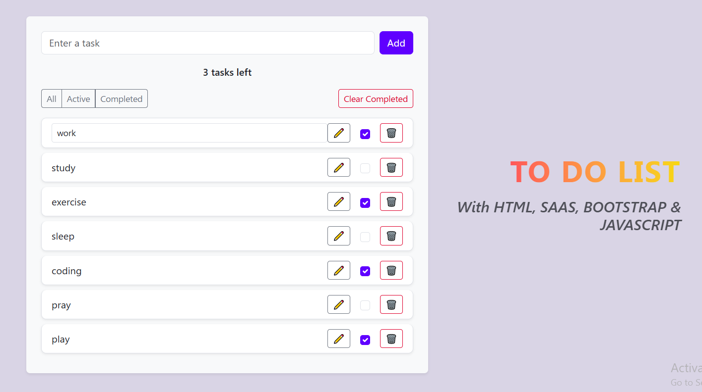
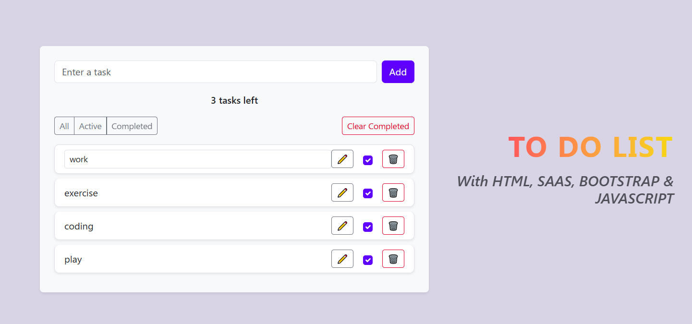
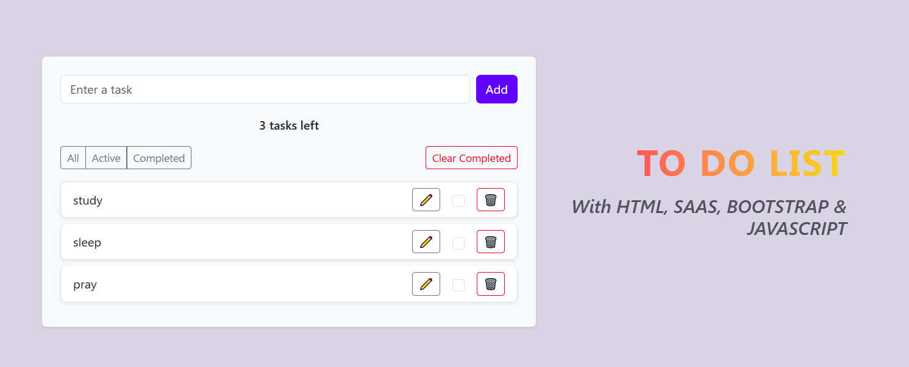
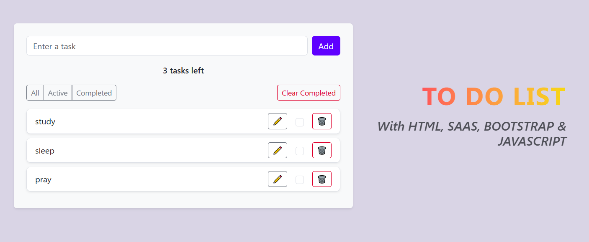

# To-Do App

A simple and interactive To-Do application built with HTML, CSS, and JavaScript.

## Features

- Add new tasks
- Edit existing tasks
- Delete tasks with a custom button
- Mark tasks as completed
- Clear all tasks
- Responsive layout for mobile and desktop

## Tech Stack

- HTML
- CSS + SCSS
- JavaScript (ES6)
- Bootstrap

## Live Demo

[Open the live app](https://warda-create.github.io/todoapp/)

## Run Locally

```bash
git clone https://github.com/Warda-create/todoapp.git
cd todoapp
start index.html
```

## Project Structure

```text
todoapp/
  assets/
  css/
  scss/
  app.js
  index.html
```

## Screenshots








